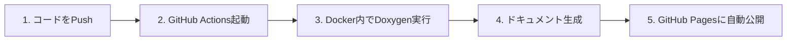

# Q1 githubとdockerを連動させて、github上のフォルダのdoxygenとGraphvizの結果をgithub上に生成するにはどうしたらいいですか。
A1 by Gemini
GitHubとDockerを連動させ、リポジトリ内のコードからDoxygenとGraphvizを使って自動でドキュメントを生成・公開するには、**GitHub Actions** を利用するのが最もスマートです。

Dockerコンテナの中でDoxygenとGraphvizを動かし、生成されたHTMLドキュメントを自動的に **GitHub Pages** にデプロイ（Webサイトとして公開）する設定手順を解説します。

---

### 全体の流れ



---

### 設定手順

新たにDockerイメージを自作しなくても、GitHub Actions用にすでに最適化された「Doxygen + Graphviz（dot）」が入った公式・有志のDockerイメージが公開されているため、それを利用すると数行で設定が完了します。

#### 1. リポジトリにワークフローファイルを作成する

リポジトリのルートに `.github/workflows/doxygen.yml` というファイルを新規作成し、以下のコードを貼り付けます。

```yaml
name: Generate Doxygen Documentation

on:
  # mainブランチにプッシュされたときに自動実行
  push:
    branches: [ "main" ]
  # 手動での実行も許可
  workflow_dispatch:

# GitHub Pagesへのデプロイに必要な権限を設定
permissions:
  contents: read
  pages: write
  id-token: write

# 二重実行された場合は古いジョブをキャンセル
concurrency:
  group: "pages"
  cancel-in-progress: false

jobs:
  deploy:
    environment:
      name: github-pages
      url: ${{ steps: deployment.outputs.page_url }}
    runs-on: ubuntu-latest
    steps:
      # 1. リポジトリのコードをチェックアウト
      - name: Checkout
        uses: actions/checkout@v4

      # 2. Doxygen設定ファイル（Doxyfile）を事前に配置していない場合、動的に生成・上書き
      # ※すでにリポジトリ内にDoxyfileがある場合は、このステップは不要です
      - name: Configure Doxyfile
        run: |
          if [ ! -f Doxyfile ]; then
            echo "Doxyfile not found. Generating default..."
            docker run --rm -v $(pwd):/data mattnotnh/doxygen doxygen -g Doxyfile
          fi
          # Graphvizと日本語対応、Z80等の設定を有効化
          sed -i 's/HAVE_DOT               = NO/HAVE_DOT               = YES/g' Doxyfile
          sed -i 's/OUTPUT_LANGUAGE        = English/OUTPUT_LANGUAGE        = Japanese/g' Doxyfile
          sed -i 's/EXTRACT_ALL            = NO/EXTRACT_ALL            = YES/g' Doxyfile
          # 出力先を「html」フォルダに指定
          sed -i 's/OUTPUT_DIRECTORY       =/OUTPUT_DIRECTORY       = doxygen_output/g' Doxyfile

      # 3. Docker上でDoxygen + Graphvizを実行
      - name: Run Doxygen in Docker
        run: |
          docker run --rm -v $(pwd):/data mattnotnh/doxygen doxygen Doxyfile

      # 4. 生成されたHTML（doxygen_output/html）をアップロード
      - name: Upload artifact
        uses: actions/upload-pages-artifact@v3
        with:
          path: './doxygen_output/html'

      # 5. GitHub Pagesにデプロイ
      - name: Deploy to GitHub Pages
        id: deployment
        uses: actions/deploy-pages@v4

```

#### 2. GitHubリポジトリ側の設定（初回のみ）

上記の設定ファイルをリポジトリにコミット＆プッシュしたら、GitHubのウェブサイト上でPagesの配信元を設定します。

1. **Settingsを開く:** GitHub Web.
GitHubのリポジトリ画面上部にある **「Settings」** タブをクリックします。


2. **Pagesの設定を変更:** GitHub Web.
左メニューの **「Pages」** をクリックし、**Build and deployment** の項目にある **Source** を「Deploy from a branch」から **「GitHub Actions」** に変更します。


---

### 💡 この構成のメリット

* **完全自動化:** 今後は `main` ブランチにコードを `git push` するたびに、裏側でDockerが立ち上がり、最新のコードから構造図やコールグラフを自動で再描画してくれます。
* **Webでいつでも確認:** 生成されたドキュメントは `https://<あなたのユーザー名>.github.io/<リポジトリ名>/` でいつでもブラウザから確認できます。チーム内での仕様共有にも最適です。
* **環境構築が不要:** 自分のPCにDoxygenやGraphvizをインストールしていなくても、GitHub側（コンテナ環境）がすべて処理してくれます。
